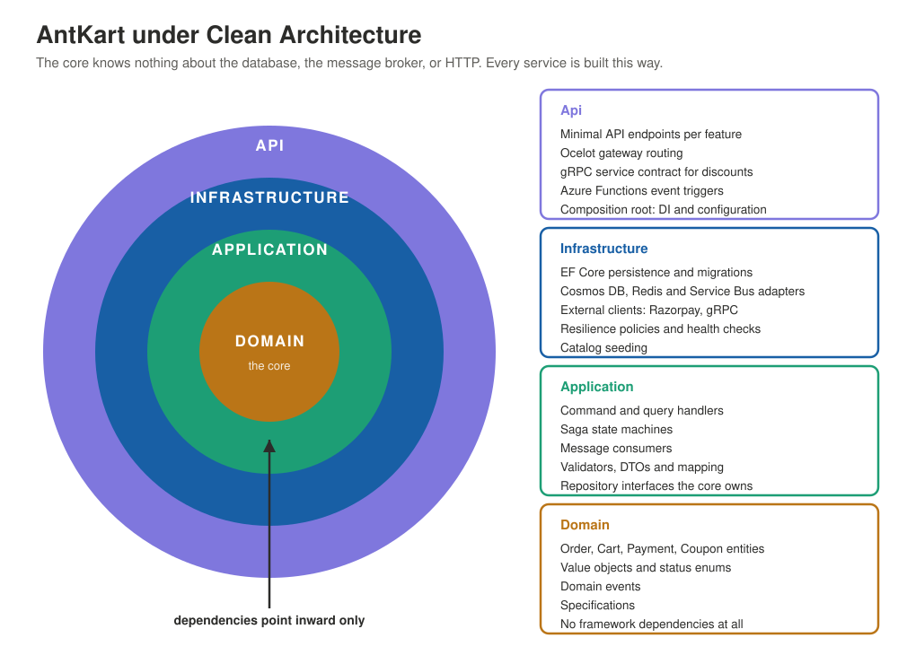
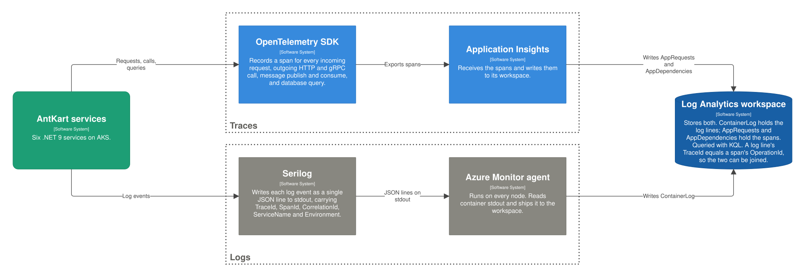

# AntKart — cloud-native e-commerce platform

A production-grade cloud-native platform on Azure — six .NET 9 microservices on AKS, provisioned entirely with Terraform, delivered by GitOps, with no stored secrets anywhere.

> Requires an Azure subscription. This platform runs on real, billable cloud resources; see the [provisioning runbook](docs/guides/environment-provisioning-runbook.md) for cost control.

AntKart is a **.NET 9** e-commerce platform of **six microservices** plus a **serverless notifications app**, running on **Azure Kubernetes Service**, provisioned with **Terraform and Terragrunt**, and delivered by **GitHub Actions and Argo CD**. This page is the front door: one diagram per topic, each linking into the [Development Guide](DevelopmentGuide.md) for the detail.

**Deployed to Azure** and served over a trusted Let's Encrypt production TLS certificate. Environments are stopped between sessions to control cost, so a running endpoint is not guaranteed at any given moment. (An earlier Phase-1 build ran locally on Docker Compose in a separate repository — [AntKart-MS](https://github.com/seesathish/AntKart-MS); this repository is the cloud-native platform.)

## System overview

<picture>
  <source media="(prefers-color-scheme: dark)" srcset="docs/C4Renders/renders/SystemOverview-dark.svg">
  
</picture>

Customers reach the platform through one public HTTPS endpoint; behind it, six services and a serverless notifications app coordinate over Azure Service Bus. Everything it touches — identity, payments, email, certificates, DNS — is a managed external system. Start with the [Development Guide](DevelopmentGuide.md) for how it is built, or read on for one topic at a time.

## Platform architecture

<picture>
  <source media="(prefers-color-scheme: dark)" srcset="docs/C4Renders/renders/PlatformArchitecture-dark.svg">
  
</picture>

Every service is the same inside: a dependency-free domain core, an application layer of CQRS handlers behind a validation pipeline, and a thin API host. Services never call each other synchronously for business flows — they coordinate through an orchestrated saga with a transactional outbox.

→ [Platform architecture](docs/development/0-platform-architecture.md)

## Infrastructure as code

<picture>
  <source media="(prefers-color-scheme: dark)" srcset="docs/C4Renders/renders/InfrastructureAsCode-dark.svg">
  
</picture>

Infrastructure is code, and a new environment is new inputs — not new code:

1. **Root configuration** — `root.hcl` generates the Terraform backend, provider and versions into every unit, so that config lives in exactly one place (DRY).
2. **Shared modules** — each environment's units compose the same reusable, versioned modules with that environment's own inputs.
3. **Isolated state** — an apply provisions the Azure resources and records per-unit state (one leased blob per unit) in Azure Storage, in a resource group of its own.

**Two environments exist — `dev` and `qa`** — built from the same modules with different inputs. The state-key collision is a solved problem, not a future risk: Terragrunt derives each state blob's path from the unit's path relative to `root.hcl`, so `dev/aks` and `qa/aks` resolve to the *identical* key — isolation comes from each environment using its **own storage container**, not from changing the key expression (changing the key expression would orphan the existing state blobs). Provisioning runs in **four dependency waves** and produces **86 resources across 18 units** per environment; the [provisioning runbook](docs/guides/environment-provisioning-runbook.md) and its Appendix D carry the wave order and the full resource inventory.

> The diagram above predates the qa build — it still draws qa as a dashed "planned" box, and must be redrawn in the Structurizr source repository. The prose here describes what actually exists.

→ [Infrastructure as code](docs/development/1-infrastructure-as-code.md)

## Azure services

<picture>
  <source media="(prefers-color-scheme: dark)" srcset="docs/C4Renders/renders/AzureServices-dark.svg">
  
</picture>

1. The customer calls `https://api.antkart.in`.
2. The **planned** API Management edge (not yet deployed — [ADR-020](docs/adr/ADR-020-api-management-managed-edge-gateway.md)) will validate the token before the cluster. **Today** the request reaches the cluster's ingress-nginx directly, and the in-cluster gateway validates the Entra JWT.
3. The gateway routes each path to the service that owns it.
4. Products asks Discount for pricing over gRPC.
5. Products reads the catalogue from Cosmos DB.
6. Cart reads and writes Redis.
7. Order, Payments and Discount use PostgreSQL — in East US 2, so these calls cross a region boundary.
8. Order and Payments publish saga and stock events to Service Bus.
9. Customer-facing events go to Event Grid, deliberately separate from the business saga.
10. Event Grid triggers the serverless notification handler.
11. The handler sends email through Communication Services.

Entra ID backs every workload identity, so no credential is stored anywhere in the platform.

The platform runs entirely on managed Azure services — Cosmos DB, PostgreSQL, Managed Redis, Service Bus, Event Grid, Functions, Key Vault, and more. Each replaced a local Phase-1 component, adopting token-based authentication throughout. API Management, the managed edge, is planned.

Container Registry, Application Insights and Log Analytics are also provisioned. They appear in the DevOps and Observability diagrams, where they belong to the flow being described.

→ [Azure services](docs/development/2-azure-services.md)

## Kubernetes

<picture>
  <source media="(prefers-color-scheme: dark)" srcset="docs/C4Renders/renders/Kubernetes-dark.svg">
  
</picture>

The six services run on a managed AKS cluster with Azure CNI Overlay and an OIDC issuer, deployed from one generic Helm chart parameterised per service. Only the gateway is exposed through ingress with cert-manager TLS; the rest are ClusterIP-only. Pods reach Azure with no stored secret via workload identity.

→ [Kubernetes](docs/development/3-kubernetes.md)

## DevOps

<picture>
  <source media="(prefers-color-scheme: dark)" srcset="docs/C4Renders/renders/DevOps-dark.svg">
  
</picture>

The developer opens a pull request; from there delivery is automatic and pull-based:

1. **Branch protection** — the pull request must pass four required checks (build-test, unit + integration tests, SonarCloud, Trivy) before it can merge to `master`.
2. **Container image** — on merge, CD rebuilds the image with an immutable commit-SHA tag and pushes it to the Azure Container Registry, authenticating to Azure with an Entra **OIDC federated credential — no stored secret**.
3. **GitOps** — Argo CD reads `master`, syncs, and updates the pods on AKS (auto-sync + self-heal). Argo pulls from Git and the kubelet pulls the image — nothing is pushed to the cluster.

→ [DevOps](docs/development/4-devops.md)

> **The workflows in `.github/workflows/` are reference implementations.** The twelve pipelines (a CI + CD pair per service) are configured for the original private repository and **will not run as-is in this public copy** — they name repository secrets, repository variables, an OIDC federated credential, a SonarCloud project, and an Azure Container Registry that exist only in that setup, so they would fail on any push or pull request here (the Actions tab may show red). Running them requires an Azure subscription plus the federated credentials and repository secrets they name. See the [DevOps section](docs/development/4-devops.md), the [`.github/workflows/` guide](.github/workflows/README.md) for exactly what each workflow needs, and the [provisioning runbook](docs/guides/environment-provisioning-runbook.md).

## Observability

<picture>
  <source media="(prefers-color-scheme: dark)" srcset="docs/C4Renders/renders/Observability-dark.svg">
  
</picture>

Every service emits two kinds of telemetry by two routes. Serilog writes one JSON line per event to stdout, carrying the trace and correlation identifiers; the Azure Monitor agent collects it from each node into `ContainerLog`. The OpenTelemetry SDK records a span for every request, HTTP and gRPC call, message, and database query, exporting through Application Insights into `AppRequests` and `AppDependencies`. Both land in the same Log Analytics workspace, so one KQL query joins a log line to its span — a log's `TraceId` is a span's `OperationId`.

→ [Observability](docs/development/5-observability.md)

## Security

<picture>
  <source media="(prefers-color-scheme: dark)" srcset="docs/C4Renders/renders/Security-dark.svg">
  
</picture>

Two authentication chains run through the platform, and neither stores a credential anywhere.

The **caller's chain** starts outside: a client signs in with Entra ID and receives an access token. The request arrives over TLS terminated at the edge, where cert-manager holds a Let's Encrypt certificate and renews it. The gateway — the only service reachable from outside the cluster — validates the token against Entra's published signing keys rather than calling Entra per request, then routes inward. Each service validates the token again instead of trusting the gateway, so a request that somehow bypassed the edge still meets a closed door.

The **workload's chain** starts inside. The cluster's own OIDC issuer signs a short-lived ServiceAccount token and projects it into each pod. The service presents that token to Entra, which matches the issuer and the subject — `system:serviceaccount:antkart:ak-order`, for example — against a federated credential, and grants the service's managed identity. That identity carries data-plane roles scoped to individual resources: Secrets User on Key Vault, sender and receiver roles on the message topics it actually uses. No connection string or client secret exists in the cluster to be leaked.

The registry sits outside both chains and follows the same principle. CI/CD authenticates to Azure with a federated credential naming the repository and environment, then pushes with AcrPush; the cluster's kubelet identity pulls with AcrPull. GitHub stores no cloud secret and the cluster holds no registry password.

One gap is tracked rather than hidden: Discount decodes the caller's token but does not verify its signature, issuer or audience (KI-002). It is ClusterIP-only and reached only by Products over gRPC, which limits the exposure but does not close it.

→ [Security](docs/development/6-security.md)

## Explore

- [Development Guide](DevelopmentGuide.md) — how the platform is built, layer by layer.
- [Testing](docs/test/README.md) — how it is verified: the automated `dotnet test` baseline (unit + integration) plus cloud-only end-to-end and security testing against the deployed platform at `api.antkart.in`.
- [Environment Provisioning Runbook](docs/guides/environment-provisioning-runbook.md) — stand up a complete new environment from an empty subscription, step by step.
- [Architect's Playbook](docs/ARCHITECT-PLAYBOOK.md) — every concept this platform uses, explained, with the gotchas that came from building it.
- [Architecture decisions](docs/adr/README.md) — the ADRs and why each choice was made.
- [Known Issues Register](docs/KNOWN_ISSUES.md) — open defects and deferred fixes, notably KI-002 and KI-005.
- [Publishing notes](PUBLISHING-NOTES.md) — what identifiers are retained deliberately in this public copy, and which placeholder values must be changed before anyone else deploys it.
