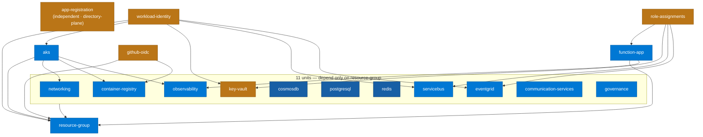
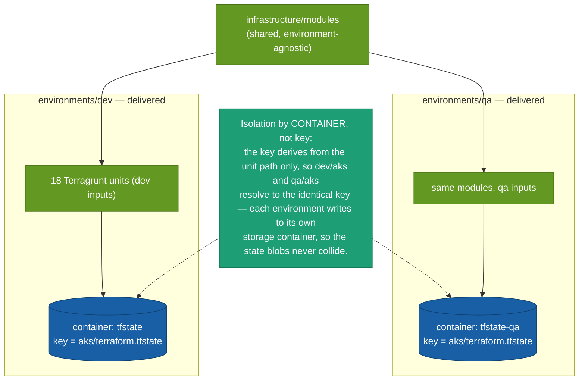

# Infrastructure as code — how the cloud gets built

> **Diagrams pending review:** _Terragrunt unit dependencies_ and _Environment promotion_ are carried across as-is and will be reworked.

Every Azure resource is provisioned as code. **Terraform modules** describe *how* a resource is built; **Terragrunt live units** wire the modules together for an environment and supply their inputs. A shared `root.hcl` generates the `backend`, `provider`, and `versions` configuration into each unit, so that configuration lives in exactly one place. Remote state is isolated **per unit** in Azure Storage, with blob-lease locking serialising applies. Both the `dev` and `qa` environments are delivered, built from the same modules with different inputs.

## Terragrunt unit dependencies

**What to notice**

- **18 live units.** `environments/dev` holds **18** unit folders; the state-backend bootstrap is an `az` step, not a Terragrunt unit.
- **`resource-group` is the root** — everything except `app-registration` traces back to it; **11 units depend on it alone** and nothing else.
- **`app-registration` is independent** — it manages a directory object via the `azuread` provider, not a resource-group resource.
- **Two composite tails carry the interesting order:** `role-assignments` waits on `function-app` + `key-vault` + `servicebus` + `eventgrid`; `workload-identity` waits on `aks` (for its OIDC issuer) + `key-vault` + `servicebus` + `eventgrid`.
- A *complete* dependency graph must show every unit; the 11 resource-group-only units are grouped to keep it legible.

## Environment promotion — dev vs QA

**What to notice**

- **Modules are shared, environments differ only by inputs:** `environments/dev` and `environments/qa` are both built — each a tree of the same 18 units reusing `infrastructure/modules` with its own inputs, not copied module code.
- **The state key is identical by design:** `root.hcl` derives the backend key from `path_relative_to_include()` — the **unit path only**, with no environment segment — so `dev/aks` and `qa/aks` both resolve to `aks/terraform.tfstate`.
- **Isolation is by container, not by key:** each environment writes to its **own storage container** (dev → `tfstate`, qa → `tfstate-qa`), so the identical keys never collide. Changing the key expression to add an environment segment would **orphan the existing state blobs** — the container is the seam, and it is already in place.

## How it was built

- Concepts first: [IaC fundamentals](../guides/iac-concepts.md).
- Step-by-step provisioning (per resource, Understand → Build → Execute → Verify): [Infrastructure Guide](../guides/infrastructure-guide.md) · the IaC map in [infrastructure/README](../../infrastructure/README.md).

## Decisions

- [ADR-012 — Infrastructure as Code with Terraform and Terragrunt](../adr/ADR-012-iac-with-terraform-terragrunt.md)

## Open items

- **Resolved:** `qa` is built alongside `dev`, and the state-key collision is handled by each environment using its own backend storage container (`tfstate` for dev, `tfstate-qa` for qa), so their identical keys never collide. See the [Roadmap](../ROADMAP.md).
